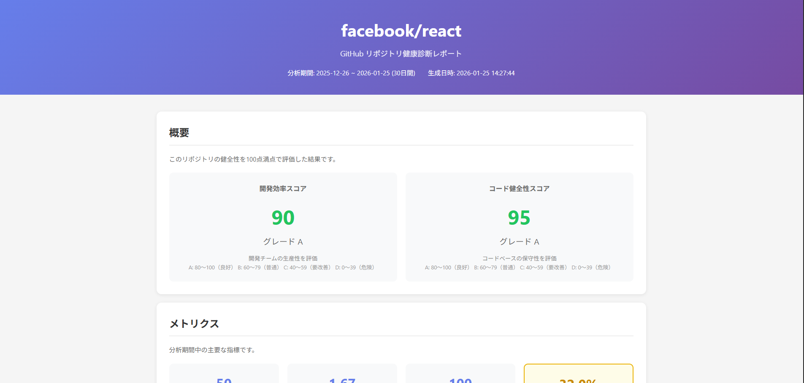

# Lokup

GitHub リポジトリの健康診断ツール。コミット履歴やコントリビューター情報を分析し、開発チームの状態を可視化します。

## 特徴

- **スコアによる評価**: 開発効率とコード健全性を100点満点で評価
- **リスク検出**: 深夜労働、属人化、変更集中などの問題を自動検出
- **HTML レポート**: 経営者にも見せられるビジュアルレポートを生成

## 使い方

```bash
# 基本的な使い方
lokup facebook/react

# 分析期間を指定（デフォルト: 30日）
lokup facebook/react --days 90

# 出力ファイルを指定
lokup facebook/react --output my-report.html
```

### GitHub Token の設定（オプション）

プライベートリポジトリを分析する場合や、API レート制限を緩和する場合は環境変数を設定してください。

```bash
export GITHUB_TOKEN=ghp_xxxxx...
```

## レポート例



## 診断項目

### 経営者向け
- 開発効率スコア（コミット頻度、リードタイムなど）
- 深夜コミット率（働き方の健全性）

### 技術者向け
- コード健全性スコア
- ホットスポット（変更が集中しているファイル）
- 属人化リスク

## 技術スタック

- **言語**: Go
- **アーキテクチャ**: Vertical Slice + Clean Architecture
- **API**: GitHub REST API
- **レポート**: html/template + Chart.js

## インストール

```bash
go install github.com/ryuka-games/lokup/cmd/lokup@latest
```

または、ソースからビルド：

```bash
git clone https://github.com/ryuka-games/lokup.git
cd lokup
go build -o lokup ./cmd/lokup
```

## 開発

```bash
# テスト実行
go test ./...

# ビルド
go build -o lokup ./cmd/lokup

# 実行
./lokup facebook/react --days 7
```

## 今後の予定

- [ ] 診断項目の追加（バグ修正割合、手戻り率、PRリードタイムなど）
- [ ] 時系列グラフの追加
- [ ] 複数リポジトリの比較機能
- [ ] OAuth 認証対応

## ライセンス

MIT
