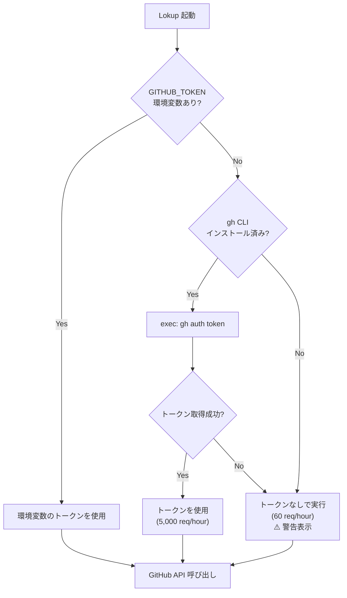
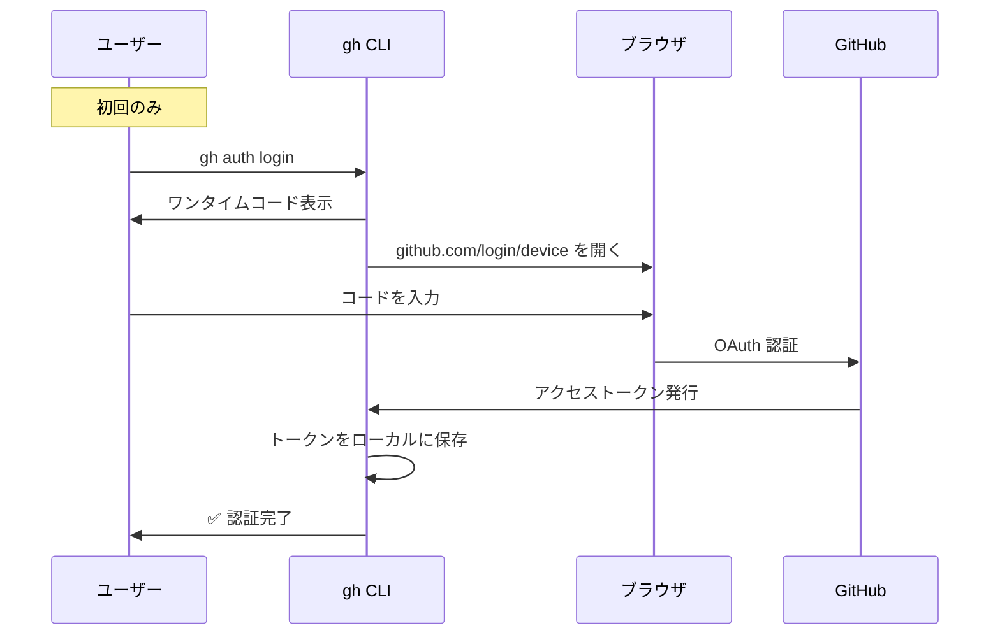
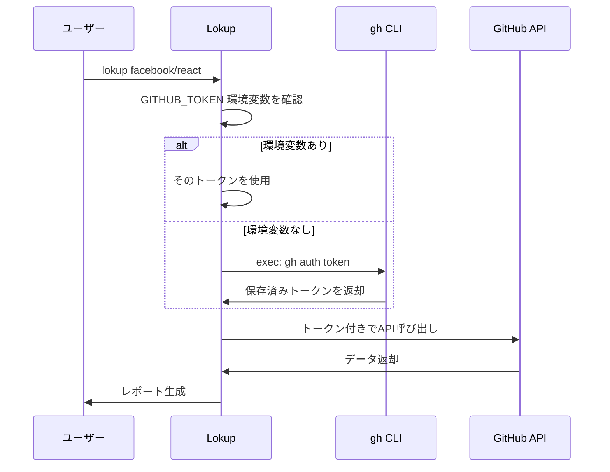
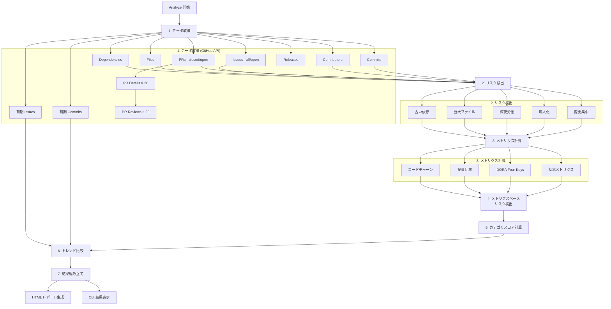
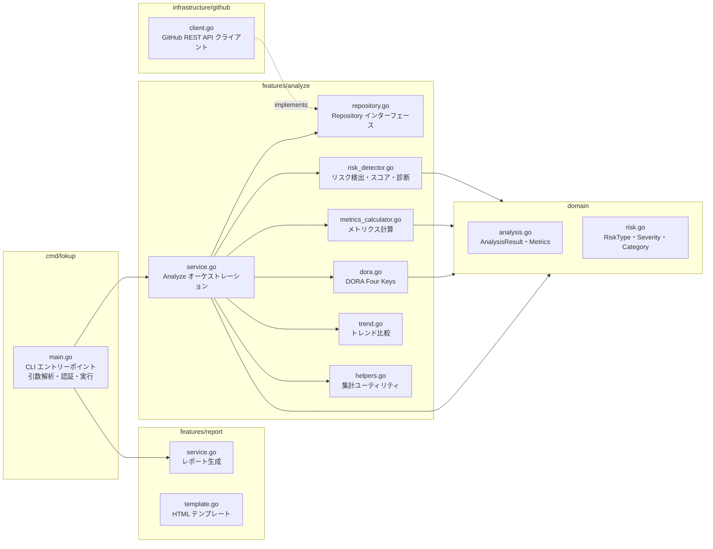

# アーキテクチャ

Lokup の処理フローと設計を図解する。

## GitHub 認証フロー

トークン取得の優先順位: `GITHUB_TOKEN` 環境変数 → `gh auth token` → なし（警告）

```mermaid
flowchart TD
    A[Lokup 起動] --> B{GITHUB_TOKEN\n環境変数あり?}
    B -- Yes --> C[環境変数のトークンを使用]
    B -- No --> D{gh CLI\nインストール済み?}
    D -- Yes --> E["exec: gh auth token"]
    D -- No --> G
    E --> F{トークン取得成功?}
    F -- Yes --> H["トークンを使用\n(5,000 req/hour)"]
    F -- No --> G["トークンなしで実行\n(60 req/hour)\n⚠️ 警告表示"]
    C --> I[GitHub API 呼び出し]
    H --> I
    G --> I
```

### 事前準備（ユーザー側）

```mermaid
sequenceDiagram
    participant U as ユーザー
    participant GH as gh CLI
    participant B as ブラウザ
    participant API as GitHub

    Note over U: 初回のみ
    U->>GH: gh auth login
    GH->>U: ワンタイムコード表示
    GH->>B: github.com/login/device を開く
    U->>B: コードを入力
    B->>API: OAuth 認証
    API->>GH: アクセストークン発行
    GH->>GH: トークンをローカルに保存
    GH->>U: ✅ 認証完了
```

### Lokup 実行時

```mermaid
sequenceDiagram
    participant U as ユーザー
    participant L as Lokup
    participant GH as gh CLI
    participant API as GitHub API

    U->>L: lokup facebook/react
    L->>L: GITHUB_TOKEN 環境変数を確認
    alt 環境変数あり
        L->>L: そのトークンを使用
    else 環境変数なし
        L->>GH: exec: gh auth token
        GH->>L: 保存済みトークンを返却
    end
    L->>API: トークン付きでAPI呼び出し
    API->>L: データ返却
    L->>U: レポート生成
```

## 分析フロー

```mermaid
flowchart TD
    A[Analyze 開始] --> B[1. データ取得]

    subgraph データ取得["1. データ取得 (GitHub API)"]
        B1[Commits]
        B2[Contributors]
        B3[PRs - closed/open]
        B4[Issues - all/open]
        B5[Files]
        B6[Dependencies]
        B7[Releases]
        B8[前期 Commits]
        B9[前期 Issues]
        B10[PR Details × 20]
        B11[PR Reviews × 20]
    end

    B --> B1 & B2 & B3 & B4 & B5 & B6 & B7 & B8 & B9
    B3 --> B10 --> B11

    B1 & B2 & B3 & B4 & B5 & B6 --> C[2. リスク検出]

    subgraph リスク検出["2. リスク検出"]
        C1[変更集中]
        C2[属人化]
        C3[深夜労働]
        C4[巨大ファイル]
        C5[古い依存]
    end

    C --> C1 & C2 & C3 & C4 & C5

    C1 & C2 & C3 & C4 & C5 --> D[3. メトリクス計算]

    subgraph メトリクス計算["3. メトリクス計算"]
        D1[基本メトリクス]
        D2[DORA Four Keys]
        D3[投資比率]
        D4[コードチャーン]
    end

    D --> D1 & D2 & D3 & D4

    D1 & D2 & D3 & D4 --> E[4. メトリクスベース\nリスク検出]
    E --> F[5. カテゴリスコア計算]
    F --> G[6. トレンド比較]

    B8 & B9 --> G

    G --> H[7. 結果組み立て]
    H --> I[HTML レポート生成]
    H --> J[CLI 結果表示]
```

## ファイル構成

```mermaid
graph LR
    subgraph cmd["cmd/lokup"]
        main[main.go<br/>CLI エントリーポイント<br/>引数解析・認証・実行]
    end

    subgraph analyze["features/analyze"]
        svc[service.go<br/>Analyze オーケストレーション]
        repo[repository.go<br/>Repository インターフェース]
        risk[risk_detector.go<br/>リスク検出・スコア・診断]
        calc[metrics_calculator.go<br/>メトリクス計算]
        dora[dora.go<br/>DORA Four Keys]
        trend[trend.go<br/>トレンド比較]
        help[helpers.go<br/>集計ユーティリティ]
    end

    subgraph report["features/report"]
        rsvc[service.go<br/>レポート生成]
        tmpl[template.go<br/>HTML テンプレート]
    end

    subgraph infra["infrastructure/github"]
        client[client.go<br/>GitHub REST API クライアント]
    end

    subgraph dom["domain"]
        analysis[analysis.go<br/>AnalysisResult・Metrics]
        riskd[risk.go<br/>RiskType・Severity・Category]
    end

    main --> svc
    svc --> repo
    svc --> risk & calc & dora & trend & help
    client -.->|implements| repo
    main --> rsvc
    svc --> dom
    risk & calc & dora --> dom
```
